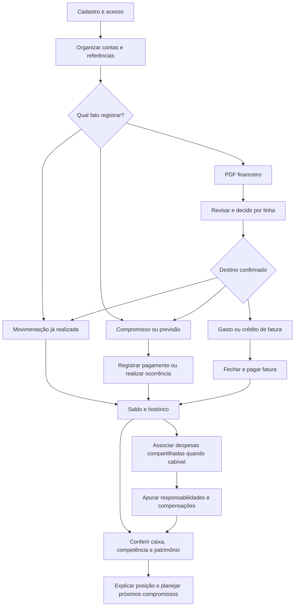

# Finisus — Portal de negócio e documentação funcional

Referência: checkout local analisado em **1º de outubro de 2026**, incluindo alterações não commitadas. Público: PO, PM, análise de negócios, QA, Scrum Master, stakeholders e desenvolvimento.

Este portal descreve o comportamento disponível no backend. “Confirmado” significa identificado no código e nos contratos, por análise estática; não significa homologado em produção. Não foram executados testes, chamadas à aplicação ou consultas a uma base real nesta entrega. Não foram inspecionadas telas do frontend: as jornadas descrevem operações do produto, sem inventar botões ou navegação.

# Resumo Executivo

**O que é:** Finisus organiza as finanças de uma pessoa em diferentes contas, registra entradas e saídas, acompanha compras no cartão, compromissos, investimentos e despesas divididas entre usuários.

**Por que existe:** 💡 Inferência baseada no comportamento do sistema: reduzir a dispersão entre extratos, faturas, controles de contas a pagar e acertos pessoais. A motivação original, público prioritário e metas comerciais precisam de validação do PO.

**Quem utiliza:** o titular de uma conta de usuário e participantes de despesas compartilhadas. Criador, pagador e recebedor são responsabilidades em uma operação, não cargos ou perfis administrativos.

**Como é utilizado:** a pessoa organiza seus cadastros, registra ou importa fatos financeiros, acompanha vencimentos, registra liquidações, confere saldos e consulta resultados.

**Processo suportado:** preparação → registro ou previsão → revisão → realização financeira → conciliação → acompanhamento. O uso é contínuo; uma consulta mensal não “fecha” contabilmente o produto.

**Capacidades centrais:** contas, transações e itens; transferências e ajustes; obrigações; recorrências; cartões e faturas; parcelamentos e financiamentos; investimentos; compartilhamentos; importação de PDF; painéis e privacidade.

**Regras mais importantes:** compromisso não reduz saldo antes do pagamento; compra no cartão não é debitada novamente quando sua despesa é analisada; transferências próprias não são renda; investimento não equivale a consumo; responsabilidade compartilhada e pagamento efetivo são informações diferentes; correções e estornos preservam rastreabilidade.

**Resultado esperado:** registros que expliquem onde está o dinheiro, o que entrou ou saiu, o que ainda precisa ser pago, quais ativos e dívidas existem e quem deve compensar quem.

**Objetivo final:** apoiar decisões financeiras com informações compreensíveis e conciliáveis. Não existe promessa de economia, rentabilidade ou quitação automática.

**Validação pendente:** o painel tem diferenças de apuração em relação a pagamentos parciais, compras parceladas e recorrências; há fluxos legados de compartilhamento e estados sem comando de conclusão. Consulte [pendências](09-pendencias-po.md) antes de tratar os indicadores como critérios de homologação.

# Uso do Sistema e Objetivo Final

## O que é o sistema

O Finisus é um registro financeiro pessoal com planejamento e acompanhamento. Cada titular mantém suas contas — dinheiro físico, conta corrente, poupança e aplicação — e associa a elas os fatos que alteram seu saldo. Categorias explicam a finalidade dos gastos; meios de pagamento identificam a forma de operação; itens detalham o que compôs uma compra.

O produto também representa fatos que ainda não movimentaram dinheiro. Uma conta a pagar, uma parcela futura ou uma ocorrência mensal prevista pode existir antes de seu pagamento. Isso permite consultar compromissos sem confundi-los com saídas já realizadas.

Pessoas cadastradas podem dividir despesas. O sistema registra quanto cada uma deveria assumir, quanto efetivamente pagou e quais compensações estão pendentes. Esses valores não são automaticamente depositados nas contas dos participantes.

O repositório entrega operações de backend consumíveis por uma interface. A existência de uma operação nesta documentação não comprova que uma tela correspondente já esteja disponível.

## Por que o sistema existe

💡 **Inferência baseada no comportamento do sistema:** sem uma base integrada, a pessoa precisaria reunir extratos, faturas, parcelas e acordos de divisão em controles separados. Isso favorece esquecer vencimentos, somar a mesma compra duas vezes, confundir transferência com receita e perder a memória dos acertos compartilhados.

O conjunto implementado procura tornar esses fatos rastreáveis. Um lançamento pode ser corrigido com motivo; uma importação é revisada antes da confirmação; uma divisão conserva as responsabilidades históricas; um pagamento vinculado pode ser estornado pelo processo que o originou.

❓ **Necessita validação com o Product Owner:** não há evidência suficiente para atribuir a criação a uma pesquisa de mercado, demanda empresarial específica ou obrigação regulatória. Também não há meta de redução de inadimplência ou indicador comercial aprovado.

## Objetivo principal

Reunir organização, realização e análise financeira pessoal em um controle no qual o usuário consiga relacionar cada saldo, compromisso e responsabilidade aos registros que os originaram.

## Objetivo Final

### Do usuário

Saber quanto possui, o que já recebeu e gastou, o que falta pagar, como estão seus investimentos e quais acertos compartilhados ainda estão abertos. Conseguir explicar diferenças e corrigir registros sem perder o histórico.

### Do negócio

💡 Inferido: oferecer um produto útil e confiável para o acompanhamento financeiro pessoal. Critérios de sucesso comercial, monetização, adesão e retenção não estão definidos no comportamento analisado e dependem do PO.

### Do processo

Uma operação está concluída quando seu resultado específico foi registrado e pode ser conferido: uma transferência possui duas pontas; uma obrigação integralmente abatida fica paga; uma importação confirmada aponta para os registros criados ou associados; uma compensação compartilhada possui referência financeira real.

O ciclo de acompanhamento está bem sucedido quando os fatos conhecidos estão registrados, os compromissos pendentes estão visíveis e as divergências estão explicadas. Não existe um comando de encerramento mensal nem garantia automática de igualdade com o banco.

## Quatro perspectivas que não podem ser confundidas

| Perspectiva | Pergunta respondida | Exemplo |
|---|---|---|
| Caixa | Que dinheiro efetivamente entrou ou saiu da conta registrada? | Pagamento de R$ 600 de uma fatura. |
| Competência | A qual período pertence a despesa ou receita analisada? | Compra de R$ 600 pertencente à fatura de outubro. |
| Compromisso | Que pagamento continua previsto ou pendente? | Obrigação de R$ 200 ainda não liquidada. |
| Patrimônio | Que ativos e dívidas compõem a posição financeira? | Contas, posições de investimentos e principal de financiamentos. |

Transferir R$ 300 entre duas contas próprias altera sua distribuição, sem gerar R$ 300 de renda. Aplicar R$ 300 reduz a liquidez da conta de origem e representa capital investido, sem se tornar despesa de consumo. Um crédito de R$ 100 numa divisão representa uma compensação a receber, sem criar automaticamente uma entrada bancária.

# Como utilizar o sistema

## Quem utiliza

- **Titular:** organiza seus dados, registra fatos e compromissos, revisa importações e acompanha resultados. Começa no cadastro e pode desativar o acesso; seus fatos financeiros permanecem registrados.
- **Criador de compartilhamento ou divisão:** estrutura a despesa ou grupo e mantém responsabilidades e vínculos conforme as permissões. A conclusão é a apuração dos pagamentos e compensações, não a simples criação do grupo.
- **Participante:** consulta sua participação; no modelo de rateio responde ao convite; numa divisão pode associar transação própria e registrar reembolso elegível.
- **Rotina automática:** gera ocorrências mensais de recorrências para usuários ativos. Não é um usuário humano nem executa o pagamento no banco.

Não foram identificados administrador, operador de caixa, contador ou perfil exclusivamente de consulta. PO e QA são leitores desta documentação, não papéis de acesso implementados.

## Como o processo começa

O uso começa quando uma pessoa quer organizar seu saldo e seus compromissos, registrar uma movimentação ou revisar um documento financeiro. Para usar operações protegidas, precisa estar cadastrada e autenticada. Antes de uma movimentação, precisa ter conta compatível e ativa; antes de usar cartão, investimento ou divisão, precisa cadastrar o respectivo contexto.

Pagamentos, compras e recebimentos externos acontecem fora do Finisus. O usuário informa sua ocorrência ou importa um documento. Não foi identificada integração que consulte o banco ou execute PIX, boleto, transferência bancária ou ordem de investimento automaticamente.

## Passo a passo do uso cotidiano

1. **Preparar o controle.** Cadastrar bancos pessoais quando necessário, contas, categorias e demais referências. A conta nasce com saldo zero; um saldo preexistente pode ser representado por ajuste justificado.
2. **Escolher o tipo de fato.** Receita ou despesa já realizada é transação; valor ainda devido é obrigação; repetição mensal é recorrência; compra de cartão pertence a fatura.
3. **Informar ou importar.** Preencher valor, data e destino; quando houver PDF, revisar as linhas e decidir criar, ignorar ou associar.
4. **Conferir validações.** Recursos devem estar acessíveis ao titular. Valor, estado, composição dos itens e condições do módulo precisam ser válidos.
5. **Registrar.** O sistema conserva o fato e seu contexto. Somente operações com efeito em caixa alteram saldo.
6. **Acompanhar compromissos.** Consultar obrigações, faturas, parcelas e ocorrências. As limitações da agenda estão explicitadas em PO-001 a PO-003.
7. **Registrar a realização.** Informar pagamento no módulo correto ou realizar ocorrência. Conferir o saldo remanescente e o vínculo com a transação.
8. **Acertar despesas conjuntas.** Relacionar pagamentos reais às responsabilidades, consultar diferenças e registrar reembolso quando elegível.
9. **Conferir resultados.** Comparar caixa, competência e patrimônio; usar reconciliação para identificar divergências do saldo interno.
10. **Corrigir com rastreabilidade.** Corrigir transação elegível com motivo ou estornar pelo módulo de origem. Cancelar não significa apagar a história.

## JORNADA-001 — Organizar e acompanhar as finanças do mês

**Objetivo do usuário:** entender sua situação financeira e manter seus fatos conciliáveis.

**Ponto de entrada:** acesso autenticado após cadastro.

**Pré-condições:** contas próprias e ativas para novos movimentos; saldo suficiente para operações que resultariam em saldo negativo; classificações válidas quando utilizadas.

**Participantes:** titular; outros usuários apenas se houver compartilhamento.

**Etapas:** preparar cadastros → registrar saldo de partida justificado → registrar receitas/despesas → cadastrar compromissos → revisar importações quando usadas → registrar liquidações → conferir saldos e analisar períodos.

**Decisões:** realizado ou previsto; pagamento direto ou cartão; operação individual ou compartilhada; criar registro novo ou associar existente.

**Regras importantes:** RN-001 a RN-005, RN-007 a RN-010, RN-012, RN-019 e RN-025.

**Possíveis impedimentos:** acesso inválido, conta inativa, saldo insuficiente, classificação inativa, estado incompatível, dados incompletos ou indicador com divergência conhecida.

**Integrações:** INT-001, interface consumidora; INT-002, leitura de PDF, se utilizada; INT-003, geração mensal.

**Resultado esperado:** movimentos e compromissos identificáveis, pagamentos vinculados e saldos conferíveis.

**Objetivo final atingido:** a pessoa consegue explicar sua posição e decidir quais compromissos priorizar, respeitando as limitações documentadas.

As jornadas específicas de cartão, importação, compartilhamento, financiamento e investimento estão em [Jornadas e processos](01-jornadas-processos.md).

## Exemplo completo de utilização

Exemplo ilustrativo sustentado pelos fluxos de conta, ajuste, obrigação e transação. Valores e nomes são fictícios; não representam teste executado.

**Situação inicial:** titular autenticado cadastra conta corrente; seu saldo no Finisus é zero. O titular informa saldo inicial de R$ 2.000 por ajuste, com motivo “Saldo de partida conferido no extrato”.

↓ **Ação do usuário:** registra obrigação “Internet” de R$ 120, credor “Provedor”, vencimento em 10 de outubro, conta de pagamento e categoria ativa.

↓ **Informações fornecidas:** descrição, credor, valor, vencimento, conta e categoria.

↓ **Validações:** conta pertence ao usuário e está ativa; categoria é utilizável; dados da obrigação são válidos.

↓ **Regras de negócio:** cadastrar dívida não paga a dívida. Saldo da conta permanece R$ 2.000.

↓ **Processamento:** obrigação registrada em aberto; pode ser consultada e integrar a agenda.

↓ **Possíveis integrações:** nenhuma chamada ao banco. O usuário realiza o pagamento por seu meio externo e depois registra no Finisus.

↓ **Mudanças de estado:** ao registrar pagamento integral, sem juros, encargos ou desconto, a obrigação passa de em aberto para paga. É criada saída vinculada de R$ 120.

↓ **Resultado apresentado ao usuário:** obrigação paga e conta com saldo de R$ 1.880; histórico permite localizar a origem da saída.

↓ **Resultado final do processo:** compromisso quitado no controle e pagamento rastreável. Se o registro estiver incorreto, o estorno pelo recurso da obrigação devolve R$ 120 ao saldo e reabre a obrigação conforme o vencimento. Isso não desfaz uma operação bancária externa.

# Visão End-to-End do Sistema

O caminho por PDF admite também ignorar uma linha ou associá-la a registro existente, sem produzir novo movimento. A figura não representa execução bancária.

## Mapa dos processos e principais funcionalidades

| Processo | Capacidades | Resultado ou conclusão |
|---|---|---|
| PROC-001 — Organização e caixa | FUNC-001 a FUNC-008 | Dados organizados e saldo rastreável. |
| PROC-002 — Compromissos | FUNC-009 e FUNC-010 | Obrigação paga ou ocorrência realizada. |
| PROC-003 — Cartões e parcelas | FUNC-011 a FUNC-013 | Fatura liquidada; parcelas restantes preservadas. |
| PROC-004 — Financiamento | FUNC-014 e FUNC-015 | Cronograma acompanhado, renegociado ou contrato finalizado quando o fluxo prevê. |
| PROC-005 — Investimentos | FUNC-016 e FUNC-017 | Movimentos e posição observada disponíveis. |
| PROC-006 — Compartilhamento | FUNC-018 a FUNC-021 | Responsabilidade, pagamento e compensação explicados. |
| PROC-007 — Importação | FUNC-022 | Lote confirmado com vínculos e sem repetição na reconfirmação. |
| PROC-008 — Acompanhamento | FUNC-023 e FUNC-024 | Indicadores e projeções consultáveis com limitações explícitas. |
| PROC-009 — Privacidade | FUNC-025 | Exportação entregue, pedido registrado ou acesso desativado. |

## Estados e integrações relevantes

Uma obrigação pode estar em aberto, vencida, paga ou cancelada; uma fatura aberta, fechada, paga ou cancelada; uma ocorrência pendente ou realizada; uma importação pendente de revisão ou confirmada. **Estado parcial** é calculado para pagamento de divisão; não é um estado próprio de fatura ou obrigação.

O frontend é um consumidor do backend. PDFs são documentos fornecidos pelo usuário e interpretados localmente. O agendamento mensal gera previsões concretizadas em ocorrências, sem liquidação automática. Não há comprovação de execução externa de pagamentos, cotações ou notificações.

## Principais conceitos e glossário resumido

| Conceito | Significado |
|---|---|
| Titular | Pessoa a quem os dados próprios pertencem. |
| Transação | Registro de entrada ou saída com origem e vínculos. Nem toda transação programada tem efeito em saldo. |
| Obrigação | Valor a pagar a um credor, com vencimento e saldo pendente. |
| Fatura | Conjunto de gastos e créditos de um cartão numa competência. |
| Ocorrência | Registro de uma recorrência para um mês, inicialmente pendente. |
| Alocação | Parte de uma transação real atribuída ao pagamento de despesa numa divisão. |
| Reembolso | Compensação entre participantes sustentada por saída real do pagador. |
| Estorno | Reversão no controle financeiro; conserva o fato anterior. |
| Reconciliação | Comparação entre saldo registrado e saldo calculado de movimentos e ajustes. |
| Posição | Valor do investimento informado para uma data; não é cotação automática. |

## Índice da documentação

1. [Jornadas e processos](01-jornadas-processos.md) — como as operações se combinam e terminam.
2. [Funcionalidades](02-funcionalidades.md) — objetivos, entradas, fluxos, exceções e resultados.
3. [Requisitos funcionais e não funcionais](03-requisitos.md) — catálogo e critérios de aceite.
4. [Regras de negócio](04-regras-negocio.md) — condições, efeitos, exceções e origem.
5. [Validações e cenários para QA](05-validacoes-cenarios.md) — limites e verificações concretas.
6. [Estados, permissões e integrações](06-estados-permissoes-integracoes.md).
7. [Domínios, glossário e escopo](07-dominios-glossario-escopo.md).
8. [Matriz de rastreabilidade e fontes](08-rastreabilidade.md) — ligação com código, testes e operações.
9. [Pontos para validação do PO](09-pendencias-po.md) — inconsistências, inferências e lacunas.

## Como interpretar e manter este portal

- ✅ **Confirmado:** comportamento encontrado em fonte executável; homologação não presumida.
- 💡 **Inferido:** interpretação de finalidade ou benefício, identificada como tal.
- ❓ **Necessita validação:** falta decisão de produto ou evidência de execução.
- ⚠️ **Inconsistência:** fontes ou comportamentos divergem; o cenário deve ser avaliado antes de mudar a regra.

Os identificadores RN-001 a RN-018 mantêm o tema do [catálogo técnico existente](../docs/regras-negocio.md). Este portal detalha e qualifica essas regras; RN-019 em diante ampliam o catálogo funcional. Não considerar a descrição técnica anterior como evidência de que um fluxo ainda esteja operacional.

O alcance de cada confirmação e as divergências estão na matriz e nas pendências. Requisitos aqui extraídos descrevem o estado atual; não constituem aprovação de roadmap nem recomendação de aceitar defeitos como comportamento desejável.
