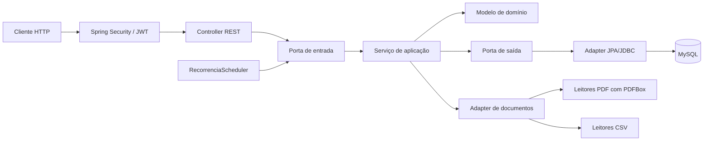
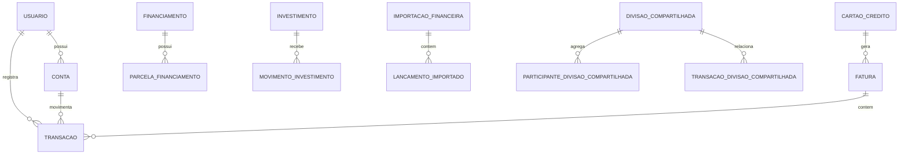

# Arquitetura

O Finisus usa o pacote-base `com.finisus` e organiza o backend em camadas com dependências voltadas ao núcleo do negócio. Spring, HTTP, JPA e JWT ficam nas bordas; os modelos de domínio não dependem desses frameworks.

## Organização do código

- `domain`: entidades, value objects, enums, exceções e invariantes do negócio.
- `application`: casos de uso, serviços, paginação e portas de entrada e saída.
- `adapters.in.web`: controllers REST, DTOs de transporte e obtenção do usuário autenticado.
- `adapters.out.persistence`: adapters JPA, entidades, repositórios e mapeamentos de persistência.
- `adapters.out.security`: implementação de criptografia de senha e emissão de tokens.
- `infrastructure`: configuração Spring, segurança, tratamento de erros, observabilidade, relógio e agendamentos.

O fluxo principal é `HTTP → controller → porta de entrada → serviço de aplicação → porta de saída → adapter JPA`. O retorno percorre o caminho inverso por DTOs; entidades JPA não fazem parte do contrato HTTP.

## Mapa rápido do sistema

| Pergunta | Local principal |
|---|---|
| Onde começa uma requisição? | `src/main/java/com/finisus/adapters/in/web` |
| Onde estão as regras coordenadas? | `src/main/java/com/finisus/application/service` |
| Onde ficam invariantes puras? | `src/main/java/com/finisus/domain/model` e `domain/vo` |
| Onde estão contratos entre camadas? | `src/main/java/com/finisus/application/ports` |
| Onde ocorre acesso ao banco? | `adapters/out/persistence`, `entity` e `repository` |
| Onde está autenticação/autorização? | `infrastructure/config/SecurityConfig`, validadores JWT e `adapters/out/security` |
| Onde estão erros HTTP? | `infrastructure/config/ApiExceptionHandler` e `SecurityProblemDetailHandlers` |
| Onde está o job mensal? | `infrastructure/scheduling/RecorrenciaScheduler` |
| Onde estão schema e índices? | `src/main/resources/db/migration` |
| Onde ocorre leitura de documentos? | `adapters/out/pdf` e `adapters/out/csv` |

## Módulos de negócio

| Módulo | Serviços principais | Persistência principal | API |
|---|---|---|---|
| Identidade e perfil | `AutenticacaoService`, `PerfilUsuarioService` | `usuario`, `refresh_token`, `solicitacao_privacidade` | `/auth`, `/usuarios/me` |
| Organização | `BancoService`, `ContaService`, `CategoriaService`, `ItemService` | `banco`, `conta`, `categoria`, `item`, `meio_pagamento` | `/bancos`, `/contas`, `/categorias`, `/itens`, `/meios-pagamento` |
| Movimentação | `TransacaoService`, `TransferenciaContaService`, `AjusteSaldoContaService` | `transacao`, itens, histórico, transferências e ajustes | `/transacoes`, `/transferencias`, `/contas/...` |
| Cartões e compromissos | `FaturaService`, `CompraParceladaService`, `ObrigacaoFinanceiraService` | cartões, faturas, pagamentos, compras e obrigações | `/cartoes`, `/compras-parceladas`, `/obrigacoes-financeiras` |
| Planejamento | `RecorrenciaService`, `PrevisaoFluxoCaixaService` | recorrências, ocorrências e previsões | `/recorrencias`, `/previsoes` |
| Financiamentos | `FinanciamentoService`, `ParcelaFinanciamentoService` | contratos, parcelas e histórico de cronograma | `/financiamentos` |
| Investimentos | `InvestimentoService`, `MovimentoInvestimentoService`, `PosicaoInvestimentoService` | investimentos, movimentos e posições | `/investimentos` |
| Divisões compartilhadas | `DivisaoCompartilhadaService` | divisões, participantes, responsabilidades, alocações e reembolsos | `/divisoes-compartilhadas` |
| Importação | `ImportacaoFinanceiraService` | importações PDF/CSV, linhas e revisões | `/importacoes-financeiras` |
| Consulta financeira | `DashboardFinanceiroService`, `PainelFinanceiroService` | leituras agregadas dos módulos anteriores | `/dashboard` |

## Domínio e aplicação

Os serviços de aplicação coordenam casos de uso e definem limites transacionais. O domínio concentra validações que não dependem de transporte ou banco, como regras de financiamento, parcelas, divisões, fatura, transação e investimento.

As portas mantêm a aplicação independente de implementação. Por exemplo, um caso de uso depende de um repositório de domínio, enquanto o adapter JPA decide consultas, entidades e mapeamentos. A data operacional é obtida por `ObterDataAtualPort`, implementado na infraestrutura com `Clock`.

Operações que alteram mais de uma entidade são tratadas como processos explícitos. Pagamento de parcela, refinanciamento, associação de transação a uma divisão, fechamento de fatura e estorno de movimento de investimento preservam consistência entre os registros envolvidos.

## Persistência e integridade

O ambiente de execução usa MySQL e Flyway. Antes do primeiro lançamento, o projeto mantém uma baseline consolidada para criar o schema final diretamente em bancos locais e de teste descartáveis. Depois que uma versão for aplicada em qualquer ambiente persistente que exija preservação de dados, ela se torna imutável e evoluções passam a usar migrations incrementais.

O modelo mantém histórico quando uma referência pode mudar no futuro. `TransacaoItem`, por exemplo, referencia o catálogo de itens e também armazena snapshots de nome, categoria e valor. Assim, a edição ou inativação do item não reescreve lançamentos existentes.

As 40 tabelas podem ser entendidas pelos agregados abaixo:

O diagrama é deliberadamente resumido. Constraints, colunas e índices têm como fonte de verdade a baseline Flyway ativa. Não foram encontradas views, procedures ou triggers.

## Integrações e processos

- **MySQL:** persistência de produção via JDBC/JPA e Flyway.
- **Documentos financeiros:** `LeitorDocumentoFinanceiroConteudoAdapter` identifica PDF pela assinatura do conteúdo e encaminha os demais arquivos ao parser CSV. Os leitores dedicados reconhecem fatura e extrato pelos cabeçalhos ou pelo conteúdo, sem depender apenas da extensão do arquivo.
- **PDFBox:** extração local de PDFs com camada de texto. Há leitores dedicados para fatura Sicredi, fatura/extrato Nubank e extrato C6, além do leitor genérico. Não há chamada para serviço externo nem OCR; PDF protegido ou sem texto extraível é recusado.
- **CSV:** parser local UTF-8, com BOM opcional, delimitado por ponto e vírgula e com suporte a campos entre aspas. Os layouts atuais são fatura com `Data de Compra`, `Descrição` e `Valor (em R$)` e extrato Sicredi com `Data`, `Descricao`, `CodTransacao`, `Identificador`, `Tipo`, `Valor` e `Saldo`. O leitor Sicredi também exige que o banco informado corresponda ao código 748 ou ao nome da instituição.
- **JWT RSA:** chaves fornecidas pelo ambiente; emissão e validação são locais.
- **Scheduler:** `RecorrenciaScheduler` executa por padrão às 00:05 no primeiro dia do mês, no fuso `America/Sao_Paulo`, e processa usuários ativos isolando falhas por usuário.
- **⚠️ Não confirmado:** mecanismo externo de backup, monitoramento, deploy ou rotação de chaves não aparece no repositório.

Não foram encontradas filas, brokers, WebClient/Feign, Redis, cache de aplicação ou métodos `@Async`.

## Pontos de maior responsabilidade

- `UseCaseConfiguration`: composição manual de serviços, decorators e métricas.
- `FaturaService`, `ImportacaoFinanceiraService`, `TransacaoService` e `DivisaoCompartilhadaService`: orquestram os fluxos com mais estados e vínculos.
- `DashboardFinanceiroPersistenceAdapter`: consultas agregadas que sustentam múltiplas leituras financeiras.
- `DadosPessoaisJdbcAdapter`: inventário executável das seções incluídas na exportação do titular.

## API e segurança

Controllers recebem entradas validadas e delegam a regra de negócio aos casos de uso. O tratamento centralizado converte falhas esperadas em `ProblemDetail`, mantendo detalhes internos fora da resposta.

O Spring Security valida JWTs na borda. Depois da validação, o token é convertido em `UsuarioAutenticado`; controllers obtêm apenas o identificador por `@UsuarioAtual`, e os casos de uso recebem esse identificador sem depender de `SecurityContext`. Consulte [Autenticação](autenticacao.md) para o fluxo de tokens.

## Operação

O Actuator expõe health, informações e métricas. A aplicação também possui agendamento para geração mensal de recorrências, configurável por cron e fuso horário. Logs não devem registrar senhas, chaves ou tokens.
