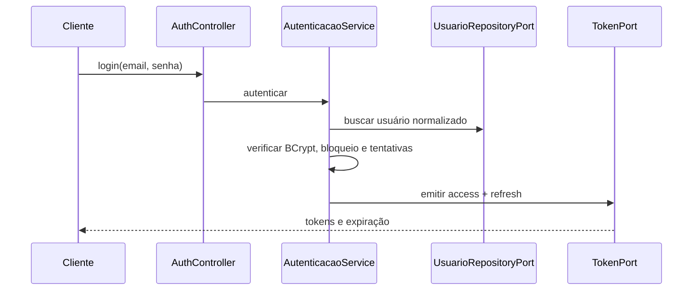

# Autenticação

O Finisus autentica requisições protegidas com JWT assinado por chaves RSA. O access token deve ser enviado no cabeçalho `Authorization: Bearer <token>`.

## Fluxos disponíveis

- `POST /api/v1/auth/cadastro` cria um usuário e exige JWT com a permissão `USUARIO_CADASTRAR`.
- `POST /api/v1/auth/login` recebe e-mail e senha, e retorna access token, refresh token e a data de expiração do access token.
- `POST /api/v1/auth/refresh` recebe um refresh token e emite um novo par de tokens.

O access token contém o identificador numérico do usuário em `sub`, o tipo `access`, a versão da sessão e a lista `permissoes`. Antes de autenticar a requisição, `UsuarioSessaoJwtValidator` verifica o tipo do token, se o usuário está ativo, se não está bloqueado e se a versão da sessão continua válida.

Cinco senhas inválidas consecutivas bloqueiam o usuário sem prazo automático. Um login válido antes da quinta falha zera o contador. O desbloqueio é manual por `POST /api/v1/usuarios/{usuarioId}/desbloquear`, exige `USUARIO_DESBLOQUEAR`, zera o contador e revoga sessões anteriores. Login inexistente, senha incorreta, usuário inativo e usuário bloqueado devolvem externamente o mesmo `401`, sem revelar a existência ou o estado da conta.

Depois da validação, a infraestrutura converte o JWT em `UsuarioAutenticado`. Controllers recebem somente o ID por `@UsuarioAtual`; casos de uso não dependem de JWT, Spring Security ou `SecurityContext`.

Falhas de autenticação e autorização seguem `application/problem+json`. Ausência ou invalidade do token usa `code: error.auth.unauthorized`; credenciais ou refresh inválidos usam `code: error.auth.invalid`; acesso autenticado sem permissão usa `code: error.auth.forbidden`. Login e refresh possuem limite local por endereço remoto; o excesso retorna `429`, `code: error.auth.rate-limit` e `Retry-After`.

## Configuração segura

O perfil `dev` recebe os locais das chaves pelas variáveis `FINISUS_JWT_PRIVATE_KEY_LOCATION` e `FINISUS_JWT_PUBLIC_KEY_LOCATION`. Senhas, chaves privadas, tokens e arquivos de configuração local não devem ser versionados, registrados em logs nem enviados em respostas de erro.

`DELETE /api/v1/usuarios/me` desativa a conta e revoga suas sessões, mas não exclui nem anonimiza os dados. O titular autenticado pode exportar seus dados e registrar/acompanhar uma solicitação de anonimização pelas rotas de `/api/v1/usuarios/me`. Essa distinção e as limitações atuais estão detalhadas em [Privacidade e ciclo de vida dos dados](privacidade-ciclo-vida.md).

Uma verificação executável percorre todos os handlers REST e exige `@UsuarioAtual` em todo controller protegido. Somente login e refresh são exceções de autenticação. Cadastro e desbloqueio exigem permissões explícitas; a autorização do recurso continua sendo validada também no caso de uso.

O CORS aceita apenas origens exatas configuradas por `APP_CORS_ALLOWED_ORIGINS`, separadas por vírgula. O padrão local é `http://localhost:4200`; curingas e listas vazias impedem a inicialização. Em cada ambiente implantado, informe somente os endereços HTTPS dos clientes autorizados. CORS não substitui autenticação nem validação de propriedade dos recursos.

## Fluxo técnico

Em chamadas protegidas, o Resource Server valida assinatura, issuer e claims. `UsuarioSessaoJwtValidator` compara a versão de sessão e o estado do usuário; `JwtUsuarioAutenticadoAuthenticationConverter` cria o principal e `@UsuarioAtual` extrai somente o ID.

## Matriz de acesso

| Recurso | Acesso |
|---|---|
| login, refresh | público |
| cadastro de usuário | `USUARIO_CADASTRAR` |
| desbloqueio manual | `USUARIO_DESBLOQUEAR` |
| `/actuator/health` | público |
| Swagger/OpenAPI | `DOCUMENTACAO_API_LER` |
| demais endpoints Actuator expostos | `OBSERVABILIDADE_LER` |
| recursos financeiros próprios | proprietário autenticado |
| divisões compartilhadas | criador ou participante, conforme operação |
| bancos globais | leitura autenticada; alteração por usuário comum recusada |

As permissões são persistidas em `usuario_permissao`; usuários criados pela API começam sem permissões administrativas. O primeiro administrador deve ser inserido manualmente após as migrations, usando `scripts/criar-primeiro-usuario-administrador.sql`. CSRF está desabilitado porque a API é stateless e usa bearer token; credenciais não são transportadas por cookie.

## Ciclo de sessão

- access token: 15 minutos por padrão;
- refresh token: sete dias por padrão e persistido por hash;
- renovação: invalida/rotaciona conforme o serviço de autenticação;
- desativação do perfil: incrementa `sessaoVersao` e invalida todos os refresh tokens;
- bloqueio e desbloqueio incrementam a versão de sessão e invalidam refresh tokens;
- tokens com tipo diferente de `access`, subject inválido, usuário inativo, bloqueado ou versão antiga são rejeitados.

O rate limit de autenticação é local a cada instância e usa `request.remoteAddr`; ele não confia diretamente em `X-Forwarded-For`. Em implantação com múltiplas réplicas, configure a limitação também no gateway ou em armazenamento compartilhado.

## Pontos sensíveis

- As chaves RSA não devem estar no classpath versionado; o perfil `dev` recebe apenas suas localizações.
- Logs estruturados incluem `correlationId`, mas não devem incluir tokens, senhas ou conteúdo financeiro.
- **⚠️ Risco técnico:** rotação de chaves e revogação global dependem do processo operacional, que não está documentado no repositório.
- **❓ Ponto para validação:** definir quem processa solicitações de anonimização e com qual autorização administrativa fora da API pública atual.
