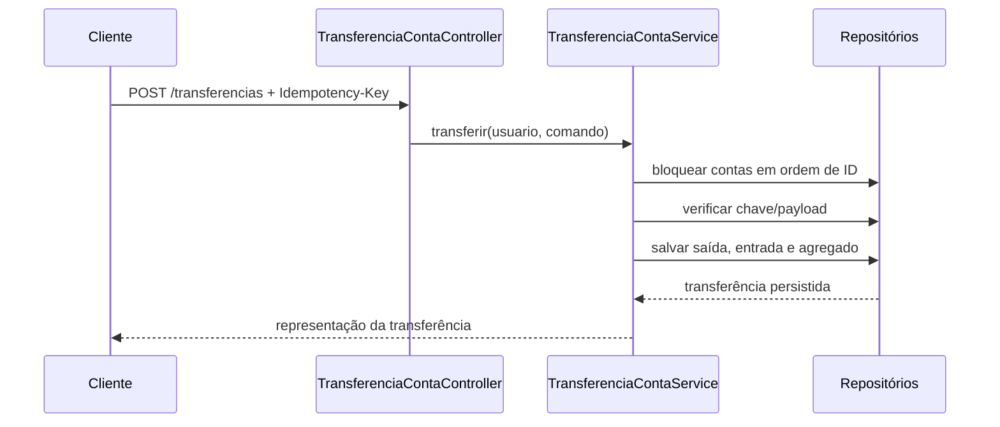
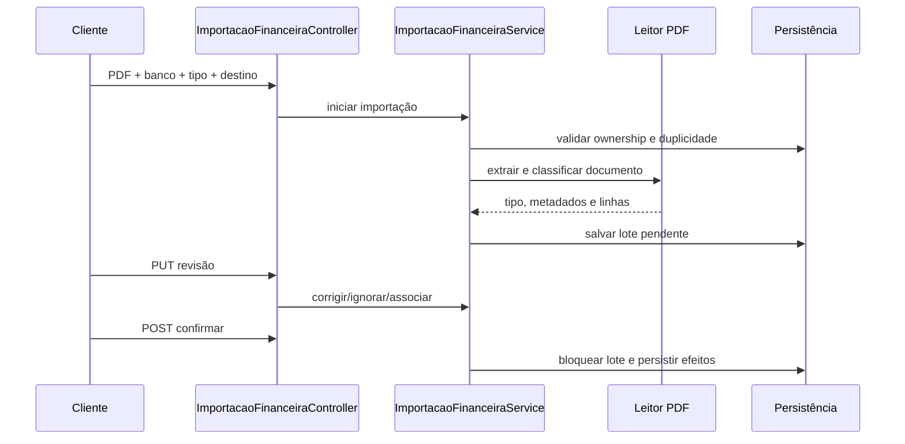

# Regras de negócio

Este documento combina o detalhamento das invariantes com um catálogo estável de regras e fluxos. Os identificadores `RN-*` e `FLX-*` servem para investigação e rastreabilidade; o código indicado é a fonte executável.

## Catálogo de regras

| ID | Regra confirmada | Implementação principal |
|---|---|---|
| RN-001 | Toda leitura ou alteração financeira é limitada ao usuário autenticado ou participante autorizado. | `ResourceOwnershipValidator` e serviços de aplicação |
| RN-002 | Somente movimentos com efeito em caixa alteram saldo; competência e compromissos permanecem separados. | `TransacaoService`, `FaturaService`, dashboards |
| RN-003 | Transferência própria possui duas pontas atômicas, não é receita/despesa e é idempotente. | `TransferenciaContaService` |
| RN-004 | Ajuste de saldo é auditável, idempotente e patrimonial, não operacional. | `AjusteSaldoContaService` |
| RN-005 | Correções de transação exigem motivo e preservam snapshots anterior e novo. | `TransacaoService`, `ConsultarHistoricoTransacaoService` |
| RN-006 | Categoria tem no máximo cinco níveis; ciclos e pai inativo são recusados. | `CategoriaService` |
| RN-007 | Ocorrência recorrente não movimenta caixa antes da realização explícita. | `RecorrenciaService` |
| RN-008 | Compra em cartão pertence à competência da fatura; pagamento pertence ao caixa. | `FaturaService`, `CompraParceladaService` |
| RN-009 | Pagamento parcial, crédito excedente e estorno de fatura preservam histórico e idempotência. | `FaturaService` |
| RN-010 | Obrigações só reduzem caixa quando pagas; principal, juros, encargos e desconto são separados. | `ObrigacaoFinanceiraService` |
| RN-011 | Financiamento preserva cronogramas antigos antes de refinanciar, amortizar ou recalcular. | `FinanciamentoService`, `ParcelaFinanciamentoService` |
| RN-012 | Aporte/resgate são patrimoniais; posição manual é a fonte do valor observado do investimento. | serviços de investimento e patrimônio |
| RN-013 | Responsabilidade compartilhada é congelada por despesa e não muda com a composição atual do grupo. | `DivisaoCompartilhadaService` |
| RN-014 | Pagamento compartilhado referencia transações reais e não cria caixa paralelo. | alocações e reembolsos de divisão |
| RN-015 | Importação é prévia até confirmação; revisão pode criar, ignorar ou associar sem duplicar efeito financeiro. | `ImportacaoFinanceiraService` |
| RN-016 | Reenvio do mesmo PDF no mesmo contexto reaproveita o lote e emite evento de duplicidade evitada. | serviço/repositório de importação |
| RN-017 | Desativar usuário revoga sessões, mas preserva fatos financeiros e compartilhados. | `PerfilUsuarioService` |
| RN-018 | Exportação do titular omite senha, tokens e hashes de idempotência. | `DadosPessoaisJdbcAdapter` |

As seções seguintes detalham condições, exceções e dados envolvidos por domínio.

## Transações, itens e saldo

- O detalhamento posterior de uma transação substitui apenas seus itens: não recalcula nem movimenta saldo e não modifica valor, conta, data, descrição ou origem.
- A soma dos itens detalhados deve coincidir com o valor da transação. O catálogo é validado no usuário autenticado e nome/categoria são copiados como snapshot.
- Uma linha pode existir sem catálogo, desde que tenha descrição. Quantidade é opcional e, quando informada, deve ser positiva. Descrição, quantidade, valor e categoria pertencem ao snapshot da transação e não mudam quando o catálogo é alterado posteriormente.
- Na importação, a descrição extraída origina uma linha livre quando nenhum item de catálogo foi associado; o sistema não cria um item de catálogo implicitamente.
- Gastos de cartão e ocorrências geradas por recorrência podem ser detalhados. Pagamentos de fatura, parcelas de compra, transferências e liquidações vinculadas exigem o fluxo do módulo de origem. Itens com compartilhamento ativo não podem ser substituídos.
- Cada detalhamento exige motivo e gera evento auditável `DETALHAMENTO_ITENS`, com correlação e snapshots anterior/novo.

## Categorias e classificação financeira

- A hierarquia de categorias aceita no máximo cinco níveis. Ciclos diretos ou indiretos e categoria pai inativa são recusados.
- A inativação é feita de baixo para cima: uma categoria com qualquer descendente ativo não pode ser inativada. Registros históricos mantêm suas referências; não há reclassificação ou exclusão em cascata.
- Categorias inativas continuam legíveis no histórico, mas não podem ser selecionadas em novas transações, itens, recorrências, compras parceladas, gastos de cartão, obrigações ou revisões de importação.
- A árvore organiza a apresentação e a análise por categoria. Ela não define a natureza financeira: entrada/saída vem da transação, enquanto transferência, ajuste, pagamento, aporte e resgate vêm de seus agregados e vínculos próprios. Nomes como "Transferência", "Fixa" ou "Investimento" não mudam a classificação da operação.

## Início da importação financeira

- Banco, tipo pretendido e destino são definidos antes da leitura e permanecem associados à importação.
- Extrato exige conta ativa do mesmo banco; cobrança exige conta ativa; fatura de cartão exige uma fatura acessível. Conta e fatura não podem ser informadas simultaneamente.
- O leitor registra o tipo efetivamente detectado. Quando ele diverge do tipo pretendido, a resposta mantém ambos e apresenta uma divergência explícita para revisão, sem criar movimento financeiro.
- O mesmo arquivo iniciado novamente só reutiliza a importação quando tipo pretendido e destino coincidem; contexto diferente é tratado como conflito.

- O estorno recompõe o saldo apenas quando o lançamento original o alterou. Gastos de cartão e parcelas programadas não movimentam o saldo no registro e, portanto, seu estorno não o modifica.
- Itens pertencem ao usuário e podem ser inativados, mas não podem ser usados em novos lançamentos quando inativos.
- Cada linha de lançamento referencia um item de catálogo e preserva nome, categoria e valor como snapshot histórico.
- Toda correção manual de transação exige motivo. O histórico imutável registra autor, instante, correlação e snapshots completos antes/depois, incluindo tipo, valor, data, descrição, conta, categoria, meio de pagamento e itens.

## Transferências entre contas próprias

- Uma transferência exige duas contas ativas, distintas e pertencentes ao mesmo usuário, além de valor positivo, data, descrição e chave de idempotência.
- A operação debita a origem e credita o destino na mesma transação de banco, criando uma saída e uma entrada vinculadas à transferência.
- As contas são bloqueadas em ordem de identificador para serializar alterações concorrentes e reduzir risco de deadlock.
- A mesma chave com o mesmo conteúdo é idempotente; a mesma chave com conteúdo diferente é recusada.
- Transferências são movimentações internas de patrimônio: seus lançamentos não representam receita nem despesa operacional e ficam fora dos dashboards operacionais.
- O estorno é feito pelo recurso da transferência, marca os dois lançamentos como estornados e recompõe os dois saldos atomicamente. Correção e estorno genéricos desses lançamentos são bloqueados.

## Reconciliação de saldo

- O saldo calculado de uma conta é a soma das entradas menos as saídas que efetivamente movimentaram seu saldo.
- Transações estornadas, compras registradas em fatura e parcelas apenas programadas ficam fora do cálculo.
- A divergência corresponde a `saldo materializado - saldo calculado`; zero indica uma conta conciliada.
- A consulta respeita a propriedade da conta e não expõe dados de outro usuário.
- Detectar divergência não autoriza correção silenciosa. O ajuste exige saldo informado, motivo e chave de idempotência, preservando o saldo anterior e o cálculo que fundamentou a diferença.
- O ajuste é uma ponte patrimonial na reconciliação, não uma receita ou despesa. Ele altera o saldo materializado e passa a compor o saldo calculado sem criar transação operacional.
- Reenvios idênticos não duplicam o ajuste; reutilizar a chave com outro saldo ou motivo é recusado.
- O histórico de ajustes permanece consultável de forma paginada e isolada por usuário e conta.

## Divisões compartilhadas por conta

- Uma divisão compartilhada identifica uma conta ou item recorrente, como água, luz, seguro, compras ou PIX.
- Todos os participantes são usuários ativos do Finisus e o criador também precisa ser participante. O grupo pode omitir percentuais para dividir cada despesa igualmente; quando informados, todos os participantes devem possuir percentual e a soma deve ser exatamente 100%.
- Cada mudança efetiva na composição ou nos percentuais fecha a vigência anterior e abre uma nova fotografia temporal. Operações que não alteram os participantes não fabricam uma nova versão, e os snapshots das despesas permanecem independentes da composição atual.
- O valor efetivamente pago vem exclusivamente das transações de saída ativas vinculadas à divisão. O pagador é o dono da transação, sem registro de pagamento paralelo.
- Cada vínculo confirmado possui ao menos uma alocação de pagamento que referencia a transação real, o pagador e o valor considerado na divisão. A alocação não cria uma segunda movimentação de caixa.
- O criador pode substituir as alocações ativas por vários pagamentos reais dos participantes. Pagamentos parciais são aceitos; a soma da despesa não supera sua base compartilhada e a soma usada de uma transação entre despesas não supera o valor dessa transação.
- A substituição cancela logicamente a composição anterior. O resumo usa somente alocações ativas cujas transações continuam válidas e com efeito em caixa.
- O criador pode cancelar uma alocação ativa individualmente. O registro não é apagado: conserva a transação, o valor, o instante e o usuário responsável pelo cancelamento e deixa imediatamente de compor os totais.
- A situação de pagamento da despesa é `PENDENTE` quando nada válido foi pago, `PARCIAL` quando o total ativo está entre zero e a base compartilhada e `QUITADO` quando o total ativo alcança a base. O valor pendente é sempre `base compartilhada - pago`.
- Reembolsos entre participantes usam uma transação real de saída pertencente ao pagador e um recebedor distinto da mesma divisão. Eles não aumentam o total da despesa: transferem posição no resumo, somando ao pagador e subtraindo do recebedor, de modo que a soma dos saldos seja conservada. O valor não pode superar nem o débito acumulado do pagador nem o crédito acumulado do recebedor até a data da transação; a divisão é bloqueada durante essa validação para serializar acertos concorrentes. Somente o criador pode cancelar um reembolso; o cancelamento lógico registra instante e usuário, retira o evento dos resumos e mantém o histórico consultável.
- Ao vincular uma transação, a responsabilidade pode ser omitida para usar a regra do grupo, informada somente por percentuais que somem 100%, ou somente por valores positivos cuja soma seja a base compartilhada. Não se misturam modos na mesma associação, e todos os responsáveis novos devem participar da divisão.
- A associação pode informar uma base compartilhada positiva e menor ou igual ao valor da transação. Apenas essa base entra como valor pago e devido na divisão; o restante continua individual e nenhum movimento de caixa adicional é criado.
- No resumo de um período, cada participante recebe o valor devido conforme o percentual configurado ou por divisão igual, e o saldo `pago - devido`. O rateio usa maiores restos, com desempate pelo menor ID do usuário, e fica congelado no vínculo. Saldo positivo representa crédito e saldo negativo representa valor abaixo da responsabilidade definida.
- Uma transação só pode pertencer a uma divisão. Transações estornadas não entram no resumo.
- Remover uma transação da divisão realiza cancelamento lógico: registra instante e usuário responsável, preserva a base e os snapshots e retira o vínculo dos resumos e pendências ativos. A mesma transação pode ser associada novamente depois do cancelamento sem apagar a versão anterior.
- A responsabilidade é congelada por lançamento em valores monetários; mudar ou remover participantes afeta somente associações futuras.
- Compra de cartão e parcela apenas prevista não contam como pagamento antes de produzirem uma saída efetiva no saldo.

## Financiamentos e parcelas

- Financiamento exige principal positivo, taxa não negativa e número de parcelas positivo.
- Em financiamentos sem juros, a soma das parcelas é exatamente igual ao principal; diferenças de arredondamento em centavos são absorvidas pela última parcela.
- Parcelas registram separadamente amortização do principal, juros, encargos e saldos devedores inicial e final. A última parcela absorve o residual de arredondamento e encerra o saldo em zero.
- Refinanciamento encerra o financiamento e preserva parcelas pagas; parcelas não pagas a partir da selecionada são excluídas.
- O refinanciamento completo cria um novo contrato ligado ao contrato de origem. A finalização da origem, a exclusão das parcelas pendentes e a criação do sucessor com seu cronograma ocorrem na mesma transação.
- No refinanciamento, o cronograma de origem é fotografado antes da exclusão das parcelas pendentes; o contrato finalizado avança a versão e mantém consultável o plano anterior.
- A amortização extraordinária debita a conta do financiamento uma única vez, registra a transação e preserva o cronograma anterior antes de substituir somente as parcelas pendentes. Parcelas já pagas não são alteradas.
- O valor amortizado não pode superar o saldo devedor. `REDUZIR_PRESTACAO` mantém a quantidade de parcelas pendentes; `REDUZIR_PRAZO` escolhe o menor prazo em que a primeira prestação recalculada não supera a vigente. A quitação elimina as parcelas pendentes e finaliza o financiamento.
- A exclusão por erro de lançamento só é permitida sem parcelas pagas. As parcelas restantes são renumeradas e recalculadas a partir da data inicial.
- Antes desse recálculo, o cronograma vigente é preservado integralmente como histórico e a versão atual do financiamento é incrementada. O histórico não é alterado por correções posteriores.
- Quando houver parcela paga, o sistema bloqueia o recálculo e o ajuste deve ser feito manualmente.
- Um financiamento ativo só pode ser cancelado quando não possui parcela paga.
- O pagamento de parcela persiste o vínculo com a transação de saída. Seu estorno devolve o valor à conta e reabre a parcela como `PENDENTE` ou `ATRASADA`, conforme o vencimento.

## Faturas, investimentos e recorrências

- A geração mensal de uma recorrência representa previsão: cria uma ocorrência pendente e não altera o saldo da conta.
- A movimentação de caixa ocorre apenas na baixa explícita da ocorrência. A baixa é idempotente por estado e mantém uma referência para a transação criada.
- Cada recorrência possui no máximo uma ocorrência por competência; os dados financeiros são copiados para a ocorrência para preservar o histórico mesmo após alterações no cadastro.

- Faturas podem ser alteradas ou canceladas apenas enquanto abertas.
- Gastos de cartão pertencem à fatura e são contabilizados no dashboard pelo mês de referência dela, mesmo que a compra tenha ocorrido em outro mês.
- O pagamento de uma fatura cria uma saída de caixa vinculada à própria fatura. O total da fatura, o valor pago e o valor em aberto são apresentados separadamente para evitar dupla contagem.
- O estorno do pagamento da fatura ocorre somente pelo comando da própria fatura: a saída é estornada uma vez e a fatura volta a `FECHADA`.
- O processamento de ciclos fecha automaticamente faturas abertas quando `dataFechamento <= dataReferencia` e cria a competência seguinte para cartões ativos. A unicidade por cartão e competência impede duplicidade em reprocessamentos.
- Fechamento e vencimento da nova competência usam os dias configurados no cartão, limitados ao último dia de meses curtos. Quando o dia de vencimento não é posterior ao fechamento, o vencimento pertence ao mês seguinte.
- Se houver ciclos atrasados, uma chamada avança mês a mês até deixar aberta apenas a próxima competência ainda não fechável. Cartões inativos não recebem novas competências.
- O resumo financeiro permite intervalos de 1, 3, 6 ou 12 meses e separa movimentações diretas, recorrências, compras parceladas, cartão e pagamentos de fatura.
- O acompanhamento anual sempre retorna os doze meses do ano consultado, inclusive quando não houve lançamentos. As categorias exibidas são as classificações reais dos lançamentos e dos itens de fatura; não há classificação automática pelo texto da descrição.
- No balancete anual, compras de cartão pertencem ao ano de referência da fatura e pagamentos de fatura entram no ano da data efetiva de pagamento. Essa separação preserva os resultados por competência e por caixa sem duplicar valores.
- Compras parceladas programadas compõem a despesa por competência e a agenda de compromissos, mas não o caixa realizado. A regra é igual nos resumos mensal, por período, anual e nos totais do balancete.
- Quando uma compra parcelada informa cartão, a primeira competência respeita o fechamento do cartão e as demais avançam mês a mês. Cada parcela referencia simultaneamente a compra de origem e uma fatura aberta; faturas ausentes são criadas com os dias de fechamento e vencimento do cartão, respeitando meses curtos. A soma da parcela com os demais gastos da fatura não pode exceder o limite. Sem cartão, a compra permanece apenas no fluxo de previsão por competência.
- Faturas fechadas aceitam múltiplos pagamentos positivos. Pagamento parcial reduz o saldo em aberto sem marcar a fatura como paga; pagamento igual ou superior ao saldo conclui a fatura, e o excesso fica registrado como crédito auditável. Ao fechar uma competência posterior do mesmo cartão, créditos ainda disponíveis são consumidos em ordem de competência, apenas até o total da nova fatura, sem movimentar novamente o caixa. Cada pagamento debita a conta escolhida uma única vez por chave idempotente. O estorno atua sobre o pagamento ativo mais recente e reabre a fatura somente se pagamentos e créditos aplicados forem insuficientes para quitá-la; a origem de um crédito já transportado não pode ser estornada isoladamente.
- Aporte e resgate são movimentações patrimoniais: reduzem ou aumentam liquidez e o resultado de caixa, mas não são gastos de consumo nem receitas operacionais nos totais, períodos e categorias dos dashboards. O balancete mantém suas linhas para conciliação.
- O painel considera despesa fixa como recorrência ativa prevista de saída; uma categoria chamada "Fixa" não altera essa classificação.
- O estorno de movimento de investimento marca o movimento original como estornado e estorna sua transação financeira associada uma única vez, sem criar uma segunda movimentação de caixa.
- Recorrências geram lançamentos somente para a competência atual ou anterior; competências futuras pertencem à previsão de fluxo de caixa.
- Parcelas ficam atrasadas somente quando o vencimento é anterior à data operacional.

## Obrigações, agenda e patrimônio

- Uma obrigação financeira nasce em `EM_ABERTO`; após o vencimento pode ficar `VENCIDA` e passa a `PAGA` somente quando a soma dos pagamentos ativos alcança o valor total.
- Criar ou vencer uma obrigação não altera o saldo. Cada pagamento integral ou parcial preserva valor base, juros, encargos e desconto separadamente. O desconto abate a dívida sem sair da conta; juros e encargos aumentam a saída sem reduzir adicionalmente o principal. Pagamentos cujo abatimento ultrapasse o saldo pendente são recusados.
- Um pagamento pode ser estornado individualmente pelo recurso da obrigação; sua saída é estornada e o saldo pendente é recomposto.
- O cancelamento é permitido somente sem valor pago. Assim, uma obrigação parcialmente liquidada exige o estorno dos pagamentos antes do cancelamento.
- A agenda financeira mostra obrigações, faturas, parcelas de financiamento, recorrências ainda não geradas e compras parceladas como compromissos. Ela não os apresenta como saldo já movimentado e limita cada consulta a 366 dias inclusivos.
- Na visão geral, compromissos pendentes vencidos antes da janela continuam reduzindo o saldo livre e são sinalizados como `VENCIDO`; a consulta de agenda isolada permanece restrita ao intervalo informado.
- Cada posição de investimento é manual e datada. Sem posição, o patrimônio informa capital líquido aportado; não infere valor de mercado, rendimento ou rentabilidade.
- Movimentos distinguem aporte, resgate, rendimento realizado e taxa. Aporte e taxa retiram caixa da conta de origem; resgate e rendimento realizado acrescentam caixa. Rendimento e taxa não são reclassificados como capital aportado ou resgatado.
- Valorização é um dado observado por meio de posição manual datada. O sistema não calcula nem registra rendimento implícito quando o extrato ou o usuário não o informou.
- Uma conta de custódia representa no máximo um investimento e não pode ser a conta de origem. No patrimônio, seu saldo é excluído do total de contas quando a posição do mesmo investimento é contabilizada, evitando dupla soma.
- Contas inativas com saldo e investimentos inativos com capital líquido ou posição informada permanecem no patrimônio. Arquivamento não elimina valor econômico remanescente.
- A conta de origem movimenta caixa; uma conta de custódia opcional, ativa e do tipo `APLICACAO`, identifica que seu saldo representa a mesma posição. Nesse caso, o patrimônio usa a posição e não soma novamente o saldo da custódia.
- A inativação não apaga patrimônio residual: contas inativas com saldo e investimentos inativos com capital líquido ou posição registrada continuam contabilizados.
- O patrimônio separa a dívida principal dos financiamentos do custo futuro de juros e encargos. O total das prestações pendentes continua disponível como compromisso contratual, mas somente o principal integra a dívida descontada dos ativos no patrimônio líquido.
- O patrimônio líquido combina saldo corrente das contas, valor da última posição de cada investimento até a referência solicitada e dívidas principais atualmente abertas. A resposta registra o instante em que saldos e dívidas atuais foram consultados e declara `patrimonioHistoricoCompleto=false`; ainda não há snapshots ou reconstrução datada desses componentes para representar uma fotografia histórica integral.
- No consolidado de divisões, crédito e compensação são calculados por `pago - devido` e permanecem separados de receitas e saldos até existir um recebimento financeiro real.

## Dados de usuário

E-mails são normalizados com `Locale.ROOT` antes do uso nas regras de negócio.

## Bancos

- Bancos cadastrados pelo usuário pertencem somente a ele. Bancos compartilhados pelo sistema podem ser consultados por todos os usuários autenticados, inclusive para identificar documentos importados.
- Não existe papel administrativo no produto atual. Por isso, atualizar ou inativar um banco compartilhado pelo sistema é recusado como recurso inacessível e nenhuma alteração é persistida.

## Importação financeira por PDF

- A importação exige um banco selecionado e um PDF legível de até 8 MB. O nome do arquivo não define o tipo do documento. PDFs compostos apenas por imagem são recusados com erro específico porque OCR ainda não é suportado.
- O conteúdo é identificado por SHA-256 no contexto de usuário e banco. Reenviar o mesmo PDF reaproveita o lote existente; o mesmo conteúdo permanece permitido para outro usuário ou banco.
- A criação é serializada por usuário e revalida o hash após adquirir a trava, impedindo que duas requisições simultâneas criem dois lotes para o mesmo documento.
- O lote fica pendente de revisão: nenhuma transação ou gasto de fatura é criado durante a leitura.
- Cada linha preserva o conteúdo extraído. Campos incertos ficam pendentes de confirmação até a revisão do usuário.
- Data, descrição, valor e tipo originalmente interpretados são snapshots imutáveis e permanecem separados dos campos correntes. Cada revisão exige justificativa e acrescenta um evento com o motivo de incerteza, a decisão humana derivada (`CRIAR`, `IGNORAR`, `ASSOCIAR_TRANSACAO` ou `ASSOCIAR_OBRIGACAO`), autor, instante e estados anterior/novo.
- Na revisão, uma linha pode ser criada, ignorada ou associada a uma transação ou obrigação já existente do mesmo usuário e destino. A transação precisa estar ativa e coincidir com o tipo, a data e o valor revisados. A associação apenas concilia o lançamento e não produz um novo efeito financeiro.
- O estado da linha acompanha o ciclo: `PENDENTE` antes da confirmação, `IGNORADA` após descarte, `ASSOCIADA` quando vinculada a registro existente e `CRIADA` quando a confirmação produz um novo registro. A confirmação de um lote já confirmado é idempotente e retorna os vínculos anteriormente persistidos sem repetir efeitos financeiros.
- Candidatas a duplicidade são consultadas pelo mesmo usuário, destino, tipo, valor e janela de três dias. Data e descrição iguais formam evidência exata; diferenças mantêm a candidata como provável. Nenhuma candidata é descartada automaticamente, e obrigações participam da mesma revisão assistida.
- Em faturas, uma linha de entrada é registrada como crédito da própria fatura. O crédito reduz o total líquido sem movimentar a conta e não é representado como saída negativa.
- A descrição extraída é suficiente para manter uma linha livre: `itemId` pode permanecer nulo e a importação não exige nem cria um item de catálogo ausente no documento.
- A confirmação exige conta para extratos e cobranças, ou uma fatura existente para gastos de cartão. Extratos viram transações; cobranças viram obrigações a pagar e só viram saída quando liquidadas. Linhas removidas na revisão não são importadas.
- A prévia informa transações ou obrigações possivelmente duplicadas quando destino, data, valor e descrição coincidem com um registro já existente. Se a candidata for uma ponta de transferência própria, a prévia também identifica o agregado da transferência. Extratos das duas contas podem associar cada linha à sua ponta correspondente sem criar quatro efeitos financeiros. A decisão continua sendo humana para não eliminar ocorrências legítimas iguais.

## Fluxos principais

### FLX-001 — Registrar transação

1. `TransacaoController.registrar` recebe JWT, comando e itens.
2. Bean Validation valida formato; `TransacaoService` valida conta, categoria, meio e catálogo no usuário.
3. O domínio cria a transação e os snapshots de item.
4. `TransacaoRepositoryPort` persiste `transacao` e `transacao_item`.
5. Se houver efeito em caixa, a conta é atualizada na mesma transação.
6. A resposta usa `TransacaoResponse`, sem expor entidade JPA.

### FLX-002 — Transferir entre contas

### FLX-003 — Processar e pagar fatura

O fechamento consolida a competência, aplica créditos anteriores e muda o estado. O pagamento exige chave idempotente, cria uma saída efetiva e registra `pagamento_fatura`; pagamentos parciais mantêm a fatura fechada e excesso produz crédito. O estorno atua pelo agregado da fatura.

### FLX-004 — Gerar e realizar recorrência

`RecorrenciaScheduler` ou a API chama `RecorrenciaService.gerarMes`, que cria uma ocorrência única por competência sem caixa. A realização posterior valida estado e cria a transação efetiva. Falhas do scheduler são isoladas por usuário e medidas.

### FLX-005 — Importar documento financeiro

### FLX-006 — Compartilhar e liquidar despesa

O criador mantém a divisão e participantes; uma transação de saída é associada com base e responsabilidades congeladas. Alocações apontam para pagamentos reais. O resumo calcula pago, devido e compensação; reembolso só é reconhecido quando possui transação real.

### FLX-007 — Solicitar privacidade

O titular exporta dados por `GET /usuarios/me/dados` ou registra pedido de anonimização. `PerfilUsuarioService` bloqueia o usuário e reaproveita uma solicitação aberta. **❓ Ponto para validação:** execução da anonimização depende de política operacional ainda não definida.

## Matriz de rastreabilidade

| Regra | Funcionalidade | Fluxo | Endpoint representativo | Serviço | Banco | Integração |
|---|---|---|---|---|---|---|
| RN-002/RN-005 | Transações e histórico | FLX-001 | `POST/PATCH /api/v1/transacoes` | `TransacaoService` | transação, itens, histórico, conta | — |
| RN-003 | Transferência própria | FLX-002 | `POST /api/v1/transferencias` | `TransferenciaContaService` | transferência, transação, conta | — |
| RN-004 | Reconciliação/ajuste | FLX-001 | `/api/v1/contas/{id}/ajustes-saldo` | `AjusteSaldoContaService` | conta, ajuste | métricas |
| RN-007 | Recorrência | FLX-004 | `/api/v1/recorrencias/...` | `RecorrenciaService` | recorrência, ocorrência, transação | scheduler |
| RN-008/RN-009 | Fatura | FLX-003 | `/api/v1/cartoes/faturas/...` | `FaturaService` | fatura, pagamento, crédito, transação | — |
| RN-010 | Obrigação | — | `/api/v1/obrigacoes-financeiras` | `ObrigacaoFinanceiraService` | obrigação, pagamento, transação | — |
| RN-011 | Financiamento | — | `/api/v1/financiamentos` | serviços de financiamento/parcela | financiamento, parcelas, histórico | — |
| RN-012 | Investimento | — | `/api/v1/investimentos` | serviços de investimento | investimento, movimento, posição | — |
| RN-013/RN-014 | Divisão | FLX-006 | `/api/v1/divisoes-compartilhadas` | `DivisaoCompartilhadaService` | divisão, responsabilidades, alocações, reembolsos | — |
| RN-015/RN-016 | Importação | FLX-005 | `/api/v1/importacoes-financeiras` | `ImportacaoFinanceiraService` | importação, linhas, revisões | PDFBox |
| RN-017/RN-018 | Perfil e privacidade | FLX-007 | `/api/v1/usuarios/me` | `PerfilUsuarioService` | usuário, tokens, solicitação e dados transversais | JWT |

## Glossário técnico

| Termo | Definição |
|---|---|
| Base compartilhada | Parte do valor de uma transação que entra em uma divisão. |
| Crédito de fatura | Excesso de pagamento reutilizável em competência posterior, sem novo caixa. |
| Efeito em caixa | Indicação de que o lançamento deve alterar saldo materializado. |
| Estado do lançamento importado | `PENDENTE`, `IGNORADA`, `ASSOCIADA` ou `CRIADA`. |
| Patrimônio histórico incompleto | Consulta que combina posições datadas com saldos/dívidas atuais e declara essa limitação. |
| Responsabilidade | Valor/percentual congelado que um participante deve em uma despesa. |
| Saldo livre | Liquidez após compromissos considerados pelo painel; não equivale a saldo bancário puro. |
